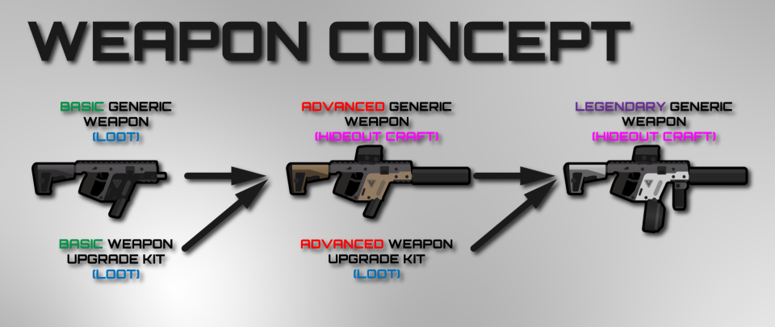

 Juego de Proyectos II hecho en c++ con SDL.

## ENLACES
[PÁGINA WEB](https://www.pivotaltracker.com/n/projects/2489079)\
[PIVOTAL (editable)](https://www.pivotaltracker.com/n/projects/2489079)\
[DIAGRAMA UML](https://lucid.app/lucidchart/invitations/accept/355e2dc6-1896-49d8-9c1d-601517544eb8)\

DOME es un survival shooter scroller 2D donde controlas a un superviviente en un refugio establecido en un lejano planeta y cada día deberás aprovechar las horas del día para viajar a localizaciones que disponga de los objetos que necesitas para sobrevivir en ese hostil y frío planeta. Durante las horas de noche el frío es mortal por lo que deberás ir al refugio a descansar y gestionar tus recursos. ¿Serás capaz de escapar?

### Día a día

Mecánica principal/loop de juego: cada día el jugador 12 horas para saquear localizaciones y otras 12 para descansar y gestionar sus recursos en el refugio ya que será de noche y el frío puede acabar con tu vida. Si has terminado de realizar tus objetivos, podrás saltar la etapa de 12 horas para pasar a la siguiente.

### Raid

Los lugares de saqueo serán pequeños y contendrán loot dependiendo del lugar (farmacia--> medicinas , supermercado---> comida, etc) rápidos de recorrer en los que el jugador gastará tiempo del día. Solo podrá saquear lo que su equipamiento y su estado (herido, hambriento, cansado  le permita llevar de vuelta al refugio.

Estos lugares pueden presentar obstáculos como puertas bloqueadas, necesidad de contraseñas o herramientas para saquearlo completamente.

Existe la posibilidad de volver a la misma localización por si en la anterior etapa de 12 horas no terminaste de saquearlo por completo.

Los lugares de saqueo tendrán descripciones que ayuden al jugador a saber que esperar. Por ejemplo en una casa abandonada la descripción  podría indicar peligro de esta forma: gran número hostiles en la zona , posiblemente haya medicinas.

### Refugio

El refugio es una zona pequeña donde el jugador podrá construir y mejorar diferentes estaciones de crafteo, crear items o descansar.

Ejemplo: caja de comida (comida se caduca un 10% más lenta, 4 espacios), nevera pequeña (comida se caduca un 25% más lenta, 8 espacios), nevera (comida se caduca un 50% más lenta, 16 espacios)

### Equipamiento

El jugador dispondrá de un inventario tipo tetris donde almacenar los objetos que quiera llevarse a la hora de saquear y para almacenar los nuevos que saquee.

Arma: distintos tiers de armas facilitan el combate contra ciertos enemigos, o por ejemplo ciertos enemigos son resistentes y el jugador deberá llevar algún tipo de arma con capacidad para eliminarlos.

Armadura: Afecta la resistencia del jugador, ciertas mejoras o armaduras darán resistencia a efectos para por ejemplo poder saquear una zona contaminada o con radiación. El 

Mochila: Aumenta la capacidad del inventario del jugador.

### Loot

El loot constará de partes completas y otras que serán parte de otras más grandes crafteables. 
Dentro de las completas encontramos:
-Armas: de distintos tiers y tipos.
-Comida.
-Bebida.
-Etc.

Dentro de las crafteables encontramos: (Esto es de ejemplo, se puede cambiar y añadir cosas)
-Munición: pólvora + cobre.
-Vendaje: tela + desinfectante.
-Mochila: cuero + cuerda.
-Etc.

En general el loot de las zonas será escaso y forzará al jugador a saquear unos items antes que otros por necesidad y tiempo.

### Combate

Combate de point and click con posibilidad de agacharte detrás de objetos y levantarte para disparar.
Los mapas tendrán verticalidad con plataformas, pero el jugador no podrá navegar el mapa con solo su salto; necesitará usar las escaleras del mapa.
Hay daño de caída (una caída notable tiene una posibilidad de causar una concusión o una lesión, con mayor probabilidad mientras más grande la caída).
El daño no se refleja en puntos de golpe, sino en efectos de estado o heridas. Cada ataque de cada enemigo puede inflingir ciertos tipos de herida. Si en algún momento el jugador sufre de 5 heridas diferentes, muere. Cada herida (ejs.: quemadura, músculo desgarrado, concusión, hemorragia) aportará una debilidad al jugador, parecidos a los efectos negativos del frío, el hambre, la sed y el cansancio.
Las armas no son perfectamente certeras. Siempre que el jugador apunte, habrá una desviación oscilante en la trayectoria de su puntería.
BAJA PRIORIDAD: El jugador se puede agachar, reduciendo su tamaño y velocidad de movimiento, pero reduciendo la desviación de sus disparos.
BAJA PRIORIDAD: Las balas atraviesan las plataformas, de tal forma que si una criatura está directamente sobre otra, puedan dispararse.

### Supervivencia

Comida: Si se pasan dos días sin comer, se aplicará el debufo de hambre. Hay dos tipos de ración de comida: proteínas (carne) y vitaminas (verdura). Comer uno de cada en un solo día se considera una comida completa, y aportará un bufo al jugador que le otorgará un 15% de probabilidad de evitar sufrir heridas cuando recibe daño. Este efecto dura un día.

Bebida: Si no se bebe una ración de agua cada día, se aplicará el debufo de sed. Si no se bebe un día en el que ya está sediento el personaje, muere.

Descanso: Por cada 30 minutos por encima de 6 horas que se duerme, el tiempo de viaje a una raid se reduce en un 5%, hasta un máximo de 40% de reducción. De tal forma que el de tiempo jugable final de la raid será Tf = (12-Tv) + min(0.4, 0.05*(m/30))*(12-Tv); siendo Tf el tiempo final, Tv el tiempo de viaje no modificado, m/30 el número de incrementos de 30 minutos dormidos por encima de las 6 horas. Esta modificación se aplica también en negativo, de tal forma que si se duermen solo 4 horas, el tiempo de viaje a la raid se incrementa un 20%, reduciendo la cantidad de tiempo que se tiene para jugar el nivel.

Hambre: El hambre es un debufo stackeable que reduce el espacio de carga. Cada nivel de hambre adquirido deshabilida el último espacio disponible del inventario (modo fácil) o un espacio aleatorio (modo difícil). Si hay un objeto en el espacio deshabilitado en el momento de aplicarse el debufo, ese objeto se colocará en el almacenamiento del refugio. Comer una ración de comida restará dos niveles de hambre; comer una comida completa restará todos los niveles de hambre.

Sed: La sed es un debufo que reduce la precisión de las armas, incrementando el índice de desviación de cada bala disparada. Este debufo se limpia cuando se bebe una ración de agua.

Ciertas mejoras del refugio pueden hacer esto más llevadero, una cama mejor te permite estar sin dormir durante 2 días o algo así.

### Medicina

Heridas de bala.

Heridas por corte o mordeduras si hacemos enemigo a melee.

Heridas por rebuscar en ciertos objetos peligrosos (estilo Darkest Dungeon).

Muerte por infección por no tratar las heridas de manera correcta.

Muerte por no comer beber o descansar.

Muerte por enfermedad al comer comida cruda o algo así.

Medicina para contrarrestarlo antibióticos(infecciones) vendajes(sangrados o laceraciones leves) kit medico (sacar balas grapar heridas graves o laceraciones profundas).

### Objetivos y conflictos

El jugador deberá aguantar lo suficiente para lograr saquear las piezas que permiten reparar su nave y así escapar del planeta.

### Comportamiento esperado

El jugador estará en este gameplay loop de crafteo->raid->loot->rest cada día progresando, mejorando su refugio y equipamiento, así como haciendo progreso en el objetivo final. Se espera que elija la localización más adecuada a sus necesidades y de una dificultad asequible para él, ya que de lo contrarió morirá. En caso de que muera lo esperable es que entienda a la perfección cual ha sido su fallo para mejorar la siguiente partida.

Es un challenge de supervivencia donde el jugador tendrá que gestionar las necesidades de su avatar para completarlo sin morir y en el menor tiempo posible.

Hay que hablarlo

El juego tiene estetica en pixel-art, concretamente en 64-bits. Esta ambientado en la cupula de un planeta desertico.

##### Teclado
###### In-game

AD -> Movimiento lateral

WS -> Seleccionar el subir y bajar escaleras

SPACE -> Saltar

SHIFT -> Agacharse

Movimiento del raton -> Apuntar

Click izquierdo -> Disparar

R -> Recargar el arma

F -> Abrir el inventario

E -> Interactuar con elementos del mapa

ESC -> Menu de pausa

###### Menu inventario

F-> Volver al jueg0

Click izquierdo -> Arrastrar un objeto del inventario

Click derecho -> Rotar el objeto que estas arrastrando

  

### Menu de inicio
En este menu el jugador tendra la opcion de salir del juego,ir al juego o  irse al menu de opciones
### Menu de opciones
Menu de ajustes donde el jugador podra seleccionar el idioma del juego y el volumen del mismo.
### Menu de selección de raid
En este menu el jugador tendra que seleccionar a que zona del mapa se quiere dirigir para efectuar la raid. Ademas en la parte superior izquierda se veran los estados del jugador para facilitarle el ver que es lo que mas necesita en ese momento. Tambien aparecera la distacia que hay al lugar y el tiempo que podras pasar en el.

### Menu de pausa
Este menu aparecera si una vez in-game el jugador pulsa esc, aqui el jugador podra irse al menu de opciones, volver a la partida o volver al menu principal
### Inventario
Menu que se le abrira al jugador cuasndo pulse la F, aqui el jugador podra ver el estado de su armadura, la vida que le queda y sus distintos estados ademas de la hora que es en ese momento y los objetos que tiene en el inventario.

### Menu interactuar con espacios de almacenamiento
En este menu el jugador podra arrastrar objetos del lugar de almacenamiento a su inventario y viceversa.

## Interfaz In-Game
Hay que discutirlo

- *This War of Mine (Supervivencia día a día)*
- *Escape from Tarkov (Raids / Equipamiento)*
- *Project Zomboid (Skills / Equipamiento)*
- *Metro Exodus (Crafting / Loot)*
