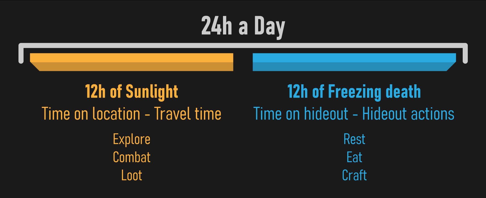
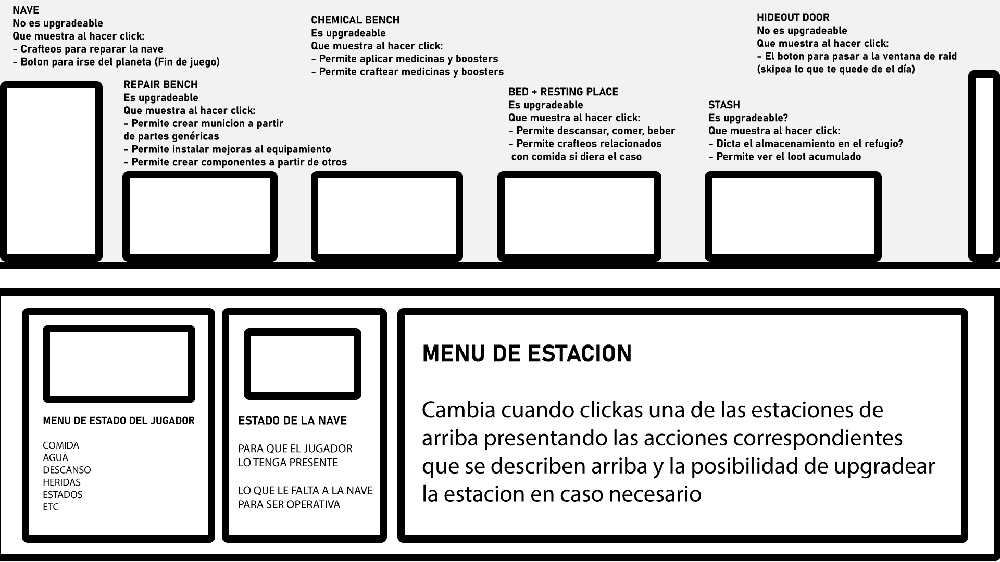
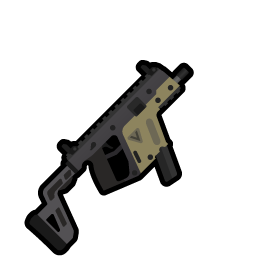
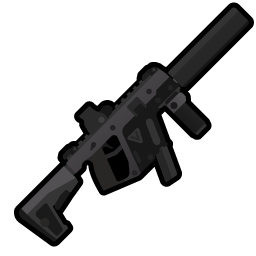
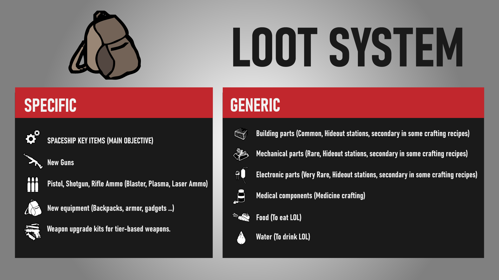
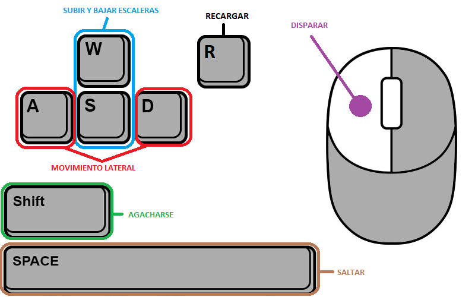
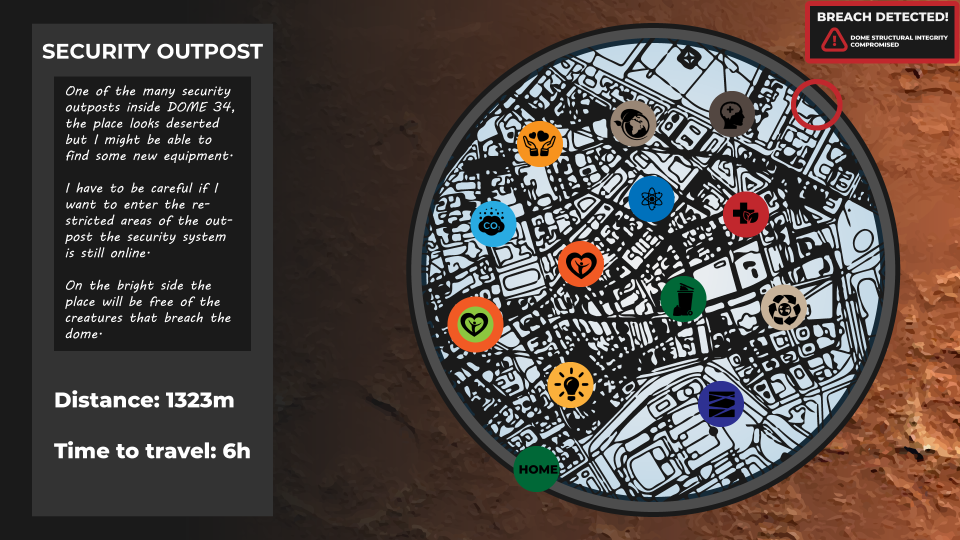
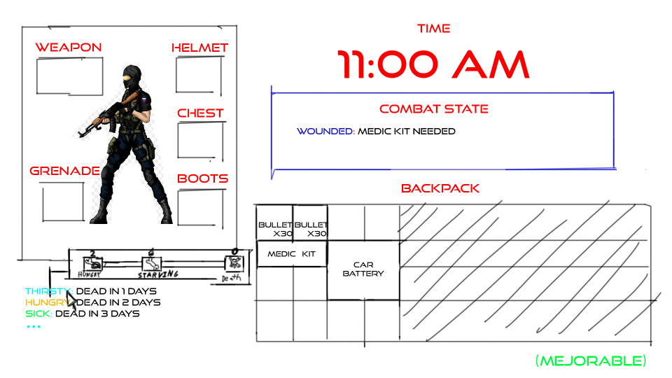
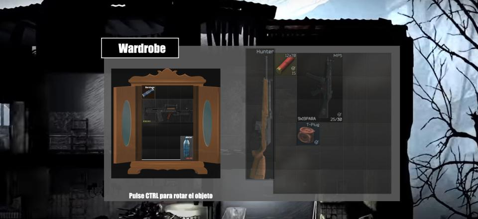

 Juego de Proyectos II hecho en c++ con SDL.

## ENLACES
[PÁGINA WEB](https://www.pivotaltracker.com/n/projects/2489079)\
[PIVOTAL (editable)](https://www.pivotaltracker.com/n/projects/2489079)\
[DIAGRAMA UML - CLASES](https://lucid.app/lucidchart/invitations/accept/355e2dc6-1896-49d8-9c1d-601517544eb8)\
[DIAGRAMA UML - COMPONENTES](https://discordapp.com/channels/810899981404733490/810934029078495262/810945073994006599)\

DOME es un survival shooter scroller 2D donde el jugador controlará a uno de los últimos supervivientes de una colonia establecida en el planeta helado Aurora. Cada día, deberá aprovechar las horas de luz para buscar los objetos que necesita para sobrevivir en este hostil y frío lugar. Además, durante las horas de noche el frío es mortal por lo que deberá volver al refugio a descansar y gestionar sus recursos. ¿Serás capaz de escapar?.

### Día a día

El jugador tendrá que escapar del planeta antes de que pasen unos dias determinados (31 dias, que podrán disminuir con respecto a la dificultad) antes de que el refugio se congele y el jugador quede encerrado en Aurora.

Así, cada día de juego el jugador dispondrá de 12 horas (que se jugarán como 12 minutos cronometrados) para saquear puntos de interés, seguidas por otras 12 (que se gestionan como recurso de forma discreta) para descansar y gestionar sus recursos en el refugio, ya que será de noche y el frío le impedirá salir.

### Raid

Los lugares de saqueo serán pequeños, rápidos de recorrer y contendrán botín escaso dependiendo del lugar (farmacia--> medicinas , supermercado--> comida, etc) en los que el jugador gastará tiempo del día. Solo podrá saquear lo que su equipamiento y su estado (herido, hambriento, cansado) le permita llevar de vuelta al refugio.

La dificultad de cada lugar de saqueo será definido por el peligro que presentan los enemigos (apartado "Combate") que haya. Además, la distancia sobre el mapa entre el lugar de saqueo y el refugio reducirá el tiempo del cual dispone el jugador para saquear.

Estos lugares pueden presentar obstáculos como puertas bloqueadas, necesidad de contraseñas o herramientas para saquearlo completamente.

Existe la posibilidad de volver a la misma localización por si en el anterior ciclo no terminaste de saquearlo por completo.

Los lugares de saqueo tendrán descripciones que ayuden al jugador a saber que esperar. Por ejemplo en una casa abandonada la descripción  podría indicar peligro de esta forma: gran número hostiles en la zona, posiblemente haya medicinas. No obstante, al principio del juego solo estarán descritas un poequeño número de zonas. Una zona no descrita aún se puede saquear, pero el jugador no sabrá a qué se enfrenta ni qué recompensas esperar. Cuando se complete un saqueo, independientemente del resultado, se desbloquearán la descripciones de las dos zonas más cercanas sobre el mapa a la zona saqueada.

Para poder volver al refugio, el jugador tendrá que salir por la zona por la que entró. En caso de que tarde más del tiempo del dia, empezará a implantarse en él un estado de hipotermia o congelacion, que dependiendo de la tardanza puede conllevar desde un pequeño debufo hasta la muerte del jugador.

### Refugio

El refugio es una zona pequeña donde el jugador podrá construir y mejorar diferentes estaciones de crafteo, crear objetos o descansar. En él, el jugador podrá interactuar con distintas estructuras del refugio para realizar acciones que gastarán parte del tiempo (discreto) disponible. Cuando gaste todo el tiempo, o bien cuando se vea sin acciones, podrá dormir y avanzar al siguiente día.

Las estructuras estarán ya situadas en distintas zonas del refugio (cohete, base de datos, terminal, mesa de crafteo??), pudiendo el jugador interactuar con ellas para mejorarlas, repararlas, o realizar acciones. Además, habrá alguna forma de almacenamiento del loot obtenido en la raid (nevera, armario, despensa {podrá ser limitado o no dependiendo de feeling del gameplay}).

En un principio, el jugador podrá seleccionar las distintas localizaciones para poder acceder a las acciones disponibles.
*MEDIA PRIORIDAD: El jugador se moverá en el propio refugio.*

### Inventario

El jugador dispondrá de un inventario por bloques, como en los comienzos de la saga Resident Evil, donde almacenar los objetos que quiera llevarse a la hora de saquear. Cada objeto ocupará un espacio diferente (pero siempre cuadrilatero) en el inventario, y la distribución eficiente del espacio físico permitirá al jugador cargar con más objetos.

Además, habrá una seccion en la que el jugador pueda establecer su equipamiento (armas, armaduras).

#### Armas

Existen tres categorías de armas que facilitan el combate contra ciertos enemigos, (ciertos enemigos son resistentes, con algunas armas será más facil dar al enemigo, etc.) que además podrán ser mejoradas en el refugio para obtener distintos efectos/estadísticas.

- **Armas de pólvora:** trazan una línea recta que colisiona con el primer objeto o enemigo que encuentre. Pistola --> subfusil --> fusil de asalto. Requieren balas como munición.

- **Armas de energía:** el jugador debe mantener pulsada la tecla de disparo por un momento para cargar el arma antes de disparar. Los proyectiles atraviesan enemigos. Requieres de baterías como munición.

- **Armas poliméricas:** disparan un proyectil de alta velocidad que rebota sobre superficies hasta colisionar con un enemigo. La primera fase solo rebota una vez, la segunda puede rebotar dos veces y la última puede rebotar cuatro veces. Requieren filamento poliatílico como munición.

*BAJA PRIORIDAD: Alguna de las armas de arriba implementa algun tipo de daño AOE.*

Además, durante la raid, podremos cambiar entre arma principal y la que haya en el inventario durante la raid.

#### Armaduras

Afecta la resistencia del jugador, ciertas mejoras o armaduras darán resistencia a efectos para por ejemplo poder saquear una zona contaminada o con radiación. El 

#### Mochilas

Aumenta la capacidad del inventario del jugador.

### Combate

- Combate de point and click con posibilidad de agacharte detrás de objetos y levantarte para disparar.
- Los mapas tendrán verticalidad con plataformas, pero el jugador no podrá navegar el mapa con solo su salto; necesitará usar las escaleras del mapa.
- Hay daño de caída (una caída notable tiene una posibilidad de causar una concusión o una lesión, con mayor probabilidad mientras más grande la caída).
- El daño no se refleja en puntos de golpe, sino en efectos de estado o heridas. Cada ataque de cada enemigo puede inflingir ciertos tipos de herida. Si en algún momento el jugador sufre de 5 heridas diferentes, muere. Cada herida (ejs.: quemadura, músculo desgarrado, concusión, hemorragia) aportará una debilidad al jugador, parecidos a los efectos negativos del frío, el hambre, la sed y el cansancio.
- Las armas no son perfectamente certeras. Siempre que el jugador apunte, habrá una desviación oscilante en la trayectoria de su puntería.

*BAJA PRIORIDAD: El jugador se puede agachar, reduciendo su tamaño y velocidad de movimiento, pero reduciendo la desviación de sus disparos.*
*BAJA PRIORIDAD: Las balas atraviesan las plataformas, de tal forma que si una criatura está directamente sobre otra, puedan dispararse.*

### Supervivencia

- **Comida:** Si se pasan dos días sin comer, se aplicará el debufo de hambre. Hay dos tipos de ración de comida: proteínas (carne) y vitaminas (verdura). Comer uno de cada en un solo día se considera una comida completa, y aportará un bufo al jugador que le otorgará un 15% de probabilidad de evitar sufrir heridas cuando recibe daño. Este efecto dura un día.

- **Bebida:** Si no se bebe una ración de agua cada día, se aplicará el debufo de sed. Si no se bebe un día en el que ya está sediento el personaje, muere.

- **Descanso:** Por cada 30 minutos por encima de 6 horas que se duerme, el tiempo de viaje a una raid se reduce en un 5%, hasta un máximo de 40% de reducción. De tal forma que el de tiempo jugable final de la raid será Tf = (12-Tv) + min(0.4, 0.05*(m/30))*(12-Tv); siendo Tf el tiempo final, Tv el tiempo de viaje no modificado, m/30 el número de incrementos de 30 minutos dormidos por encima de las 6 horas. Esta modificación se aplica también en negativo, de tal forma que si se duermen solo 4 horas, el tiempo de viaje a la raid se incrementa un 20%, reduciendo la cantidad de tiempo que se tiene para jugar el nivel.

- **Hambre:** El hambre es un debufo stackeable que reduce el espacio de carga. Cada nivel de hambre adquirido deshabilida el último espacio disponible del inventario (modo fácil) o un espacio aleatorio (modo difícil). Si hay un objeto en el espacio deshabilitado en el momento de aplicarse el debufo, ese objeto se colocará en el almacenamiento del refugio. Comer una ración de comida restará dos niveles de hambre; comer una comida completa restará todos los niveles de hambre.

- **Sed:** La sed es un debufo que reduce la precisión de las armas, incrementando el índice de desviación de cada bala disparada. Este debufo se limpia cuando se bebe una ración de agua.

Ciertas mejoras del refugio pueden hacer esto más llevadero, una cama mejor te permite estar sin dormir durante 2 días o algo así.

### Enemigos

Pepega a melee: comportamiento más agresivo, rushea al jugador cuando se da cuenta de su presencia y ataca en "horda", el jugador deberá ser rápido eliminando a estos enemigos ya que el combate a melee es peligroso.

Pepega a rango: comportamiento más cauteloso, se comportan como guardias usando coberturas para frenar el avance del jugador siguen patrones de disparo que el jugador deberá usar para eliminarlos.

### Medicina

Heridas de bala.

Heridas por corte o mordeduras si hacemos enemigo a melee.

Heridas por rebuscar en ciertos objetos peligrosos (estilo Darkest Dungeon).

Muerte por infección por no tratar las heridas de manera correcta.

Muerte por no comer beber o descansar.

Muerte por enfermedad al comer comida cruda o algo así.

Medicina para contrarrestarlo antibióticos(infecciones) vendajes(sangrados o laceraciones leves) kit medico (sacar balas grapar heridas graves o laceraciones profundas).

### Objetivos y conflictos

El jugador deberá aguantar lo suficiente para lograr saquear las piezas que permiten reparar su nave y así escapar del planeta.

### Comportamiento esperado

El jugador estará en este gameplay loop de crafteo->raid->loot->rest cada día progresando, mejorando su refugio y equipamiento, así como haciendo progreso en el objetivo final. Se espera que elija la localización más adecuada a sus necesidades y de una dificultad asequible para él, ya que de lo contrarió morirá. En caso de que muera lo esperable es que entienda a la perfección cual ha sido su fallo para mejorar la siguiente partida.

Es un reto de supervivencia donde el jugador tendrá que gestionar las necesidades de su avatar para completarlo sin morir y en el menor tiempo posible.

### Localizaciones

| Nombre | Sprite | Desc | Dificultad/Enemigos |
|--------|--------|-------|-------|
| Puesto de seguridad | N/A | bla bla bla bla bla | 3 pepegas |
| N/A | N/A | N/A | N/A |

### Contenedores

| Nombre | Sprite | Loot table | 
|--------|--------|-------|
| Estantería | N/A | Componentes electrónicos (5-10) / Materiales (10-20) |
| N/A | N/A | N/A |

### Equipamiento

#### Armas
| Tier 1 | Tier 1 Sprite | Tier 2 | Tier 2 Sprite | Tier 3 | Tier 3 Sprite |
|--------|--------|--------|--------|--------|--------|
| Tier 1 Weapon | | Tier 2 Weapon | | Tier 3 Weapon | |

#### Armaduras/Trajes
| Nombre | Sprite | Stats | 
|--------|--------|-------|
| N/A | N/A | N/A |

### Loot en localización

#### Específico
| Nombre | Sprite | Tamaño de stack | Uso |
|--------|--------|-----------------|-----|
| Kit de mejora básico | N/A | 1 | Permite la mejora de armas a nivel 2 |
| Kit de mejora avanzado | N/A | 1 | Permite la mejora de armas a nivel 3 |
| N/A | N/A | N/A | N/A | 

#### Genérico
| Nombre | Sprite | Tamaño de stack | Uso |
|--------|--------|-----------------|-----|
| Materiales de construcción | N/A | 5 | Para hacer bla bla bla |
| Partes mecánicas | N/A | 10 | N/A |
| Restos electronicas | N/A | 10 | N/A |
| N/A | N/A | N/A | N/A |

### Refúgio

#### Estación médica
| Crafteo/Acción | Sprite | Coste | Tiempo (Coste) | 
|-----|-----|-----|-----|
| N/A | N/A | N/A | N/A |

#### Taller
| Crafteo/Acción | Sprite | Coste | Tiempo (Coste) | 
|-----|-----|-----|-----|
| N/A | N/A | N/A | N/A |

### Enemigos
| Nombre | Sprite | .... | 
|--------|--------|-------|
| N/A | N/A | N/A |

El juego tiene estetica en pixel-art, concretamente en 64-bits. Esta ambientado en la cúpula de un planeta desertico. Inspirado en Kingdom.

### En partida
- **A,D ->** Movimiento lateral
- **W,S ->** Seleccionar el subir y bajar escaleras
- **SPACE ->** Saltar
- **C ->** Agacharse
- **Movimiento del raton ->** Apuntar
- **Click izquierdo ->** Disparar
- **R ->** Recargar el arma
- **Tab ->** Abrir el inventario
- **E ->** Interactuar con elementos del mapa
- **ESC ->** Menu de pausa

### En menús
- **Tab ->** Volver al juego
- **Click izquierdo ->** Arrastrar un objeto del inventario
- **Click derecho ->** Rotar el objeto que estas arrastrando

### Menu de inicio
En este menu el jugador tendra la opcion de salir del juego,ir al juego o  irse al menu de opciones

### Menu de opciones
Menu de ajustes donde el jugador podra seleccionar el idioma del juego y el volumen del mismo.

### Menu de selección de raid
En este menu el jugador tendra que seleccionar a que zona del mapa se quiere dirigir para efectuar la raid. Ademas en la parte superior izquierda se veran los estados del jugador para facilitarle el ver que es lo que mas necesita en ese momento. Tambien aparecera la distacia que hay al lugar y el tiempo que podras pasar en el.

### Menu de pausa
Este menu aparecera si una vez in-game el jugador pulsa esc, aqui el jugador podra irse al menu de opciones, volver a la partida o volver al menu principal

### Inventario
Menu que se le abrira al jugador cuasndo pulse la F, aqui el jugador podra ver el estado de su armadura, la vida que le queda y sus distintos estados ademas de la hora que es en ese momento y los objetos que tiene en el inventario.

### Menu interactuar con espacios de almacenamiento
En este menu el jugador podra arrastrar objetos del lugar de almacenamiento a su inventario y viceversa.

## Interfaz In-Game
Hay que discutirlo

- *This War of Mine (Supervivencia día a día)*
- *Escape from Tarkov (Raids / Equipamiento)*
- *Project Zomboid (Skills / Equipamiento)*
- *Metro Exodus (Crafting / Loot)*