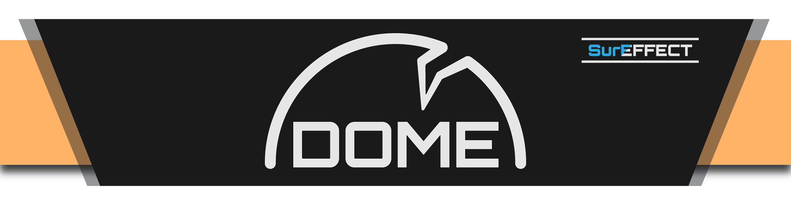

 Juego de Proyectos II hecho en c++ con SDL.

## ENLACES
[PÁGINA WEB](https://www.pivotaltracker.com/n/projects/2489079)\
[PIVOTAL (editable)](https://www.pivotaltracker.com/n/projects/2489079)\
[DIAGRAMA UML](https://lucid.app/lucidchart/invitations/accept/355e2dc6-1896-49d8-9c1d-601517544eb8)\

Survival shooter scroller 2D donde controlas a un superviviente en un refugio (upgradeable) y cada día desde un mapa seleccionas una localización para raidear(similar a This War of Mine) pero con más focus en el combate con armas de fuego y saqueo con el objetivo de conseguir mejor equipamiento de combate, comida, materiales, etc.

### Día a día

Mecánica principal/loop de juego: cada día el jugador tendrá que dividir su tiempo (24h  1min/h? 24min/loop) entre trabajar en el refugio (instalando mejoras, comiendo, descansando, crafteando items como munición o medicinas) y decidir si ir a saquear una localización seleccionada desde un mapa.

### Raid

Los lugares de saqueo serán pequeños y contendrán loot dependiendo del lugar (farmacia--> medicinas , supermercado---> comida, etc) rápidos de recorrer el jugador gastara tiempo del día mientras esta en ellos y solo podrá saquear lo que su equipamiento (y su estado? herido, hambriento, cansado ) le permita llevar de vuelta al refugio.

Estos lugares pueden presentar obstáculos como puertas bloqueadas, necesidad de contraseñas o herramientas para saquearlo completamente.

Existe la posibilidad de volver a la misma localización.

Los lugares de saqueo tendrán descripciones que ayuden al jugador a saber que esperar por ejemplo en una casa abandonada puede poner debajo de la descripción peligro: gran número hostiles en la zona o sustancia química en el aire, etc.

### Refugio

El refugio es una zona pequeña donde el jugador podrá construir y mejorar diferentes estaciones de crafteo, crear items o descansar.

Ejemplo: caja de comida (comida se caduca un 10% más lenta, 4 espacios), nevera pequeña (comida se caduca un 25% más lenta, 8 espacios), nevera (comida se caduca un 50% más lenta, 16 espacios)

### Equipamiento

El jugador dispondrá de un sistema básico de equipamiento.

Arma: distintos tiers de armas facilitan el combate contra ciertos enemigos, o por ejemplo ciertos enemigos son resistentes y el jugador deberá llevar algún tipo de arma con capacidad para eliminarlos.

Armadura: Afecta la resistencia del jugador, ciertas mejoras o armaduras darán resistencia a efectos por ejemplo para poder saquear una zona contaminada o con radiación el jugador sacrifica resistencia balística por resistencia a un cierto elemento.

Mochila: Afecta la capacidad de saqueo del jugador.

### Loot

El loot puede ser básico por ejemplo como en Metro Exodus dónde el jugador recoge componentes mecánicos y componentes químicos para crafteos y de manera más específica nuevo equipamiento (armas, mochilas, armaduras).

This War of mine usa un sistema de loot un poco más específico para crafteos con construcción, electrónicos, eléctricos, mecánicos y después el equipamiento.

Escape from Tarkov utiliza un sistema especifico de loot donde no hay abstracción en ningún caso y cada objeto está representado por sí mismo.

COMIDA: cruda (más común dura poco), enlatada (menos común no caduca)

MEDICINAS: ya creadas (más rara), por componentes (por ejemplo, ropa + antiséptico = vendas)

EN GENERAL EL LOOT DE LAS ZONAS DEBE SER ESCASO Y DEBE FORZAR AL JUGADOR A SAQUEAR UNOS ITEMS ANTES QUE OTROS POR NECESIDAD Y POR TIEMPO.

### Combate

Combate de point and click con posibilidad de agacharte detrás de objetos y levantarte para disparar

### Supervivencia

Comida: comer mínimo una vez cada dos días

Bebida: beber diariamente

Descanso: descanso una vez cada dos días

NO cumplirlo te mete debuffos que te afectan durante los saqueos, capacidad de movimiento y cantidad de objetos que puedes lootear o la velocidad con la que rebuscas en los puntos de looteo.

Ciertas mejoras del refugio pueden hacer esto más llevadero, una cama mejor te permite estar sin dormir durante 3 días o algo así.

### Medicina

Heridas de bala.

Heridas por corte o mordeduras si hacemos enemigo a melee.

Heridas por rebuscar en ciertos objetos peligrosos (estilo Darkest Dungeon).

Muerte por infección por no tratar las heridas de manera correcta.

Muerte por no comer beber o descansar.

Muerte por enfermedad al comer comida cruda o algo así.

Medicina para contrarrestarlo antibióticos(infecciones) vendajes(sangrados o laceraciones leves) kit medico (sacar balas grapar heridas graves o laceraciones profundas).

### Objetivos y conflictos

Sobrevivir, encontrar las "piezas necesarias" para un objetivo final (escapar de la isla, zona, planeta, colonia, etc).

### Comportamiento esperado

El jugador estará en este gameplay loop de crafteo->raid->loot->rest cada día progresando, mejorando su refugio y equipamiento, así como haciendo progreso en el objetivo final.

Es un challenge de supervivencia donde el jugador tendrá que gestionar las necesidades de su avatar para completarlo sin morir y en el menor tiempo posible.

### placeholder

### placeholder

### placeholder

### placeholder

- *This War of Mine (Supervivencia día a día)*
- *Escape from Tarkov (Raids / Equipamiento)*
- *Project Zomboid (Skills / Equipamiento)*
- *Metro Exodus (Crafting / Loot)*