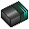
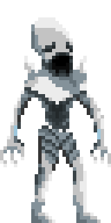

 Juego de Proyectos II hecho en c++ con SDL.

## ENLACES
[PÁGINA WEB](https://www.pivotaltracker.com/n/projects/2489079)\
[PIVOTAL (editable)](https://www.pivotaltracker.com/n/projects/2489079)\
[DIAGRAMA UML - MENUS, ESCENA Y REFUGIO](https://lucid.app/lucidchart/invitations/accept/aae27cba-d4f9-486b-8103-88b7f02d1c62)\
[DIAGRAMA UML - MECÁNICAS DE SAQUEO](https://lucid.app/lucidchart/invitations/accept/355e2dc6-1896-49d8-9c1d-601517544eb8)\
[DIAGRAMA UML - COMPONENTES](https://lucid.app/lucidchart/invitations/accept/4e6c891a-a004-42ba-a569-ac58c1c28972)\

## INDICE

- [Descripción](#desc)
- [Mecánicas](#mec)
    - [Ciclo diario](#day)
    - [Raid](#rai)
    - [Refugio](#refu)
    - [Inventario](#inv)
    - [Combate](#comb)
    - [Supervivencia](#supe)
    - [Monstruos](#enem)
    - [Medicina](#medi)
- [Dinámicas](#dina)
- [Contenido](#cont)
- [Estética](#este)
- [Controles](#keys)
- [Interfaz y menús](#hud)
- [Conclusiones QA](#conclusiones)
- [Referencias](#refe)

 

DOME es un survival shooter scroller 2D donde el jugador controlará a uno de los últimos supervivientes de una colonia establecida en el planeta helado Aurora. Cada día, deberá aprovechar las horas de luz para buscar los objetos que necesita para sobrevivir en este hostil y frío lugar. Además, durante las horas de noche el frío es tal que deberás volver al refugio a descansar y gestionar tu tiempo y recursos. ¿Serás capaz de escapar?

El juego se puede jugar en Windows, y es apto para un público mayor de 12 años, de acuerdo con la clasificación PEGI, pues contiene situaciones violentas y escenas que podrían dar miedo a audiencias más jóvenes. 

 

# Ciclo diario 

El jugador tendrá que escapar del planeta antes de que pasen 10 días antes de que el refugio se congele y el jugador quede encerrado en Aurora.

Así, cada día de juego el jugador dispondrá de 12 horas (que se jugarán como unos minutos cronometrados) para saquear puntos de interés, seguidas por otras 12 horas (que se gestionan como recurso de forma discreta) para descansar y gestionar sus recursos en el refugio, ya que será de noche y el frío le impedirá salir. Cuando termine sus tareas en el refugio, podrá dormir lo que le quede de la noche para reponer sus fuerzas y volver a explorar.

# Raid 

Los lugares de saqueo serán pequeños, rápidos de recorrer y contendrán botín escaso dependiendo del lugar (farmacia--> ingredientes de medicina, supermercado--> comida, etc) en los que el jugador gastará tiempo del día. Solo podrá saquear lo que su equipamiento y su estado (herido, hambriento, cansado) le permita llevar de vuelta al refugio.

La dificultad de cada lugar de saqueo estará definida por el peligro que presentan los enemigos que haya (apartado "Combate"). Además, la distancia sobre el mapa entre el lugar de saqueo y el refugio reducirá el tiempo del cual dispone el jugador para saquear.

Existe la posibilidad de volver a la misma localización por si en un anterior ciclo no se terminó de saquearla por completo.

Los lugares de saqueo tendrán descripciones que ayuden al jugador a saber qué esperar. Por ejemplo, la descripción del hospital delata que habrá un nivel bajo de mostruos, que el tiempo de viaje es de 1 hora y que se podrán encontrar recursos médicos, agua y suministros electrónicos. 

Para poder volver al refugio, el jugador tendrá que salir por la zona por la que entró o alguna salida adicional que se encuentre. En caso de que se tarde demasiado tiempo en volver, empezará a sufrir de hipotermia, que se ve como un efecto de hielo en la interfaz que adquiere opacidad progresivamente. Si el efecto llega a la opacidad máxima, el jugador muere.

# Refugio 

El refugio es una zona pequeña donde el jugador tendrá acceso a diferentes estaciones de crafteo para crear objetos. Además, dispone de una cama para descansar y comenzar el siguiente ciclo de día. Cada acción que el jugador realice en el refugio contará contra el tiempo que tiene aquí. A diferencia del saqueo, el tiempo aquí se cuenta de forma discreta, como un recurso, y no baja solo. Cada noche se disponen de 5 puntos de acción, representados como relojes.

Además, hay un área designada para la reparación del cohete, el objetivo final del juego. Al interactuar con el cohete, se abrirá un menú similar a las estaciones de crafteo, el cual ofrecerá una serie de posibles reparaciones al cohete, cada uno de los ciales requiere una serie de materiales concretos. Si se llegan a efectuar todas las reparaciones, habrá una nueva opción para despegar, completando el juego.

Las estructuras estarán ya situadas en distintas zonas del refugio, pudiendo el jugador interactuar con ellas para realizar acciones.

# Inventario 

El jugador dispondrá de un inventario por bloques donde almacenar los objetos que quiera llevarse a la hora de saquear. Cada objeto ocupará un espacio diferente (pero siempre cuadrilátero) en el inventario, y la organización eficiente del espacio permitirá al jugador cargar con más objetos. 

## Armas

El jugador dispone de tres armas diferentes que le aportan versatilidad en el combate. Cada arma requiere un tipo de munición diferente, estando toda la munición del jugador en su inventario. Si se agota completamente un tipo de munición, el espacio que este ocupaba en el inventario se podrá aprovechar para otros objetos. Las tres armas son:

- **Carabina de gas:** dispara un proyectil de alta velocidad que sigue una trayectoria lineal hasta impactar con un enemigo o una pared. Requieren balas como munición.

- **Láser de minería:** el jugador debe mantener pulsada la tecla de disparo por un momento para cargar el arma antes de disparar. Cuando el arma está completamente cargada, se puede soltar la tecla para disparar un láser que traza una línea recta hasta impactar con una pared, dañando a todos los enemigos que atraviese. Requiere baterías como munición.

- **Arma polimérica:** dispara un proyectil de media velocidad que rebota sobre superficies un número de veces según el nivel del arma o hasta colisionar con un enemigo. Cuando el proyectil se destruye, crea una explosión que daña a todos los enemigos cercanos que estén en visión directa del epicentro. Requieren filamento poliatílico como munición.

Se puede cambiar de arma pulsando el botón Q, ciclando por las tres armas en orden.

# Combate 

- En el combate, el jugador puede moverse por el mapa libremente en el horizontal, además de poder realizar un salto a poca altura. Mientras conrtola su movimiento con el teclado, podrá usar el ratón para operar su arma.
- Los mapas tendrán verticalidad con plataformas, pero el jugador no podrá navegar el mapa con solo su salto; necesitará usar las escaleras del mapa. Para subir o bajar una escalera, usará las teclas direccionales arriba y abajo mientras el personaje esté sobre la escalera. Mientras está en una escalera, el jugador no puede atacar.
- Las armas no son perfectamente certeras. Siempre que el jugador apunte, habrá una desviación aleatoria en la trayectoria de su puntería. Esta desviación se reduce mucho si el jugador se agacha, pero no se puede mover hasta volver a levantarse. 
- El daño no se refleja en puntos de golpe, sino en efectos de estado o heridas. Cada ataque de cada enemigo puede inflingir ciertos tipos de herida. Si en algún momento el jugador sufre de 6 heridas diferentes, muere. Cada herida (ejs.: contusión, hemorragia, dolor, intoxicación) aportará una debilidad al jugador, parecidos a los efectos negativos del frío, el hambre, la sed y el cansancio.
- Hay daño de caída: una caída de altura suficiente causa una contusión.

# Supervivencia 

- **Cansancio:** El cansancio es un debufo con niveles de intensidad que reduce la velocidad de movimiento en la raid y el tiempo de viaje hacia las localizaciones.
Para perder niveles de cansancio se podrá descansar en el refugio y cuanto más tiempo se dedique a dormir, mas descansado estará el jugador y por lo tanto su velocidad de viaje mejorará.

- **Hambre:** El hambre es un debufo stackeable que incrementa la velocidad a la que la condición de desangrado se propaga. Comer comida restará niveles de hambre.

# Monstruos 

Los dos tipos de monstruos presentes en el juego atacan a melee, causando heridas al contactar con el jugador.

Acechador: persigue al jugador por el suelo, con más vida que el persecutor.

Persecutor: persigue al jugador por los aires, manteniendo su altura cuando aún está lejos, pero adoptando un comportamiento más agresivo cuando está más cerca. 

# Salud 

El sistema de salud en raid se basa en un modelo de heridas en lugar de una barra de salud general.
Cada herida que recibes se añade a una pila de tal forma que se van acumulando. Además, cada herida aplica un debufo concreto.
La mayoría de estados simplemente se quedarán ahí hasta que le apliques la medicina correcta, aunque algunos desaparecerán solos con el paso del tiempo.
Si en algún momento el jugador tiene 6 heridas a la vez, morirá, obligándole a reiniciar su progreso.
Cuando el jugador vuelve al refugio, se le curan todas las heridas.

Heridas:

Desangrado: Esta herida se muestra como un icono de una gota de sangre que se rellena progresivamente. Cuando se llena por completo, la herida pasa a ser una hemorragia, y se añade al jugador una nueva herida de desangrado. No hay más efectos negativos, pero aún así el desangrado es la herida más peligrosa al jugador, pues puede causar que se muera por acumulación de heridas.

Contusión: Esta herida tiene un icono de un hueso roto, y bloquea el salto del jugador hasta que desaparezca. Esta herida se cura automáticamente con el paso del tiempo.

Intoxicación: Esta herida, mostrado con un icono de radiación sobre fondo verde, tiene una corta duración antes de desaparecer, durante la cual impide al jugador usar ninguna cura.

Dolor: Esta herida tiene de icono una figura tumbada con rayos saliendo de la espalda. No tiene ningún efecto adicional por sí mismo, sino que afecta a otras heridas, incrementando el tiempo que tardan las heridas de contusión e intoxicación en desaparecer.

Hipotermia. Este efecto de estado no es una herida formal, por lo que no cuenta para el número de heridas que se pueden sufrir. No es provocado por ningún enemigo, aparece cuando acaba el tiempo de raid, y va avanzando a medida que el jugador permanece en la raid. Es una forma de avisar al jugador de que va a anochecer y necesita volver al refugio. Si se deja avanzar hasta su límite, el jugador muere independiente del número de heridas que tenga.

 

# Objetivos y conflictos

El jugador deberá aguantar lo suficiente para lograr saquear las piezas que permiten reparar su nave y así escapar del planeta. La mayoría de los peligros que le acechan son fácilmente evitables si se opta por ir lento, pero esto a la vez dificulta la suficiente recolección de recursos y crea el riesgo de que se agote el tiempo.

# Comportamiento esperado

No se espera que un jugador esperado complete con éxito su primera jugada, sino que aprenda de cada muerte cómo gestionarse mejor.

El bucle de juego sigue el patrón mapa -> saqueo -> gestión y crafteo -> descanso, mejorando su equipamiento y haciendo progreso estable hacia el objetivo final. Se espera que elija cada día la localización más adecuada a sus necesidades y de una dificultad asequible, para no morir en el propio saqueo. En caso de que muera lo esperable es que entienda con claridad cual ha sido su fallo para mejorar la siguiente partida.

Es un reto de supervivencia donde el jugador tendrá que gestionar las necesidades de su avatar para completarlo sin morir y en el menor tiempo posible.

 

# Localizaciones

| Nombre | Icono | Descripción | Dificultad |
|--------|-------|-------|-------|
| Tienda |  | Establecimiento a corta distancia del refugio, una tienda abandonada infestada por acechadores y persecutores. | Media |
| Supermercado |  | Zona a media distancia del refugio, con bastantes recursos útiles para sobrevivir, pero no para escapar. | Media |
| Zona de comunicaciones |  | Área de peligro de la cúpula, la raza alienígena estableció un nido en esta zona. Se encuentra a una distancia considerable del refugio. | Alta |
| Estacion nuclear |  | Estación abandonada que debido a la radiación nuclear atrajo a un gran número de acechadores y persecutores. Aún así, los objetos a encontrar ahí pueden ser muy útiles. | Alta |
| Hospital |  | Zona a muy poca distancia del refugio, un hospital con grandes cantidades de recursos médicos pero sin muchos objetos de valor, debido a esto se encuentra poco habitado por alienígenas. | Bajo |

# Equipamiento

## Armas
| Weapon | Tier 1 Sprite |  Tier 2 Sprite | Tier 3 Sprite |
|--------|-------|-------|-------|
| Classic Weapon |  |  |  |
| Laser Weapon |  |  |  |
| Ricochet Weapon |  |  |  |

# Loot en localización

## Específico
| Nombre | Sprite | Uso |
|--------|--------|-----------------|
| Kit de mejora |  | Permite la mejora de armas a nivel 2 o 3 |
| Restos clave de la nave |  | Permite reparar la nave |
| Munición clasica|  | Permite disparar el arma clasica |
| Munición laser|  | Permite disparar el arma laser |
| Munición ricochet|  | Permite disparar el arma ricochet |

## Genérico
| Nombre | Sprite | 
|--------|--------|
| Desechos metálicos |  |
| Partes mecánicas |  | 
| Restos electronicas |  |
| Componentes médicos |  |
| Agua |  |
| Elementos orgánicos |  |
| Comida |  |

## Crafteos
| Objeto | Elementos necesarios | Uso |
|--------|----------------------|-----|
| Vendas | 2 componentes médicos + 1 agua + 1 elementos orgánicos | Curan sangrado |
| Antídoto | 1 comida + 2 agua + 2 componenetes médicos | Cura infecciones |
| Férula | 2 partes mecánicas + 1 agua | Cura contusiones |
| Painkiller | 2 comida + 1 agua + 2 componenetes médicos | Cura Dolor |
| Comida | 1 agua + 1 elementos orgánicos | Para comer |
| Cohetes de la nave | 2 restos clave de la nave + x materiales de construcción + restos electrónicos + x placas de metal | Primera parte de la nave |
| Radar de la nave | 1 restos clave de la nave + 1 restos electrónicos | Segunda nave parte de la nave |
| Cabina de la nave | 3 restos clave de la nave + 2 materiales de construcción + 1 placas de metal | Segunda nave parte de la nave |
| Arma mejorada | 2 partes mecánicas + 1 restos electrónicos + 1 kit de mejora | Aumenta el tier del arma |
| Munición arma clásica |No se craftea | Munición para el arma clásica |
| Munición arma laser | 1 Munición arma clásica + 2 partes restos electrónicos | Munición para el arma clásica |
| Munición arma ricochet | 1 Munición arma clásica + 2 partes mecánicas | Munición para el arma ricochet |
| Placas de metal | 1 materiales de construcción + 1 partes mecánicas | Para reaizar otros crafteos |

# Refúgio

## Estación médica
| Crafteo/Acción | Sprite | Coste | Tiempo (Coste) |
|-----|-----|-----|-----|
| Antidoto |  | 1 comida, 1 agua, 1 componentes medicos | 1 Accion |
| Vendas |  | 1 venda, 1 agua, 1 material organico | 1 Accion |
| Torniquete |  | 1 agua, 1 componentes mecanicos | 1 Accion |
| PainKiller |  | 2 comida, 1 agua, 2 componentes medicos | 1 Accion |

## Taller
| Crafteo/Acción | Sprite | Coste | Tiempo (Coste) |
|-----|-----|-----|-----|
| Placas metalicas |  | 1 componentes mecanicos, 1 partes de construcción | 1 Accion |
| Mejora de arma |  |  1 componentes mecanicos, 1 resto electronico, 1 kit de mejora | 1 Accion |
| Cargador normal |  |  1 componentes mecanicos, 1 componente medico, placas metalicas | 1 Accion |
| Cargador laser |  | 1 cargador normal, 2 restos electronicos | 1 Accion |
| Cargador ricochet |  | 1 cargador normal, 2 componentes mecanicos | 1 Accion |

## Nave
| Crafteo/Acción | Sprite | Coste | Tiempo (Coste) |
|-----|-----|-----|-----|
| Cabina |  | 3 partes clave de la nave, 2 placas metálicas | 1 Accion |
| Radar |  |  1 parte clave de la nave, 1 placa metálica | 1 Accion |
| Cohetes |  |  2 partes clave de la nave | 1 Accion |

# Enemigos
| Nombre | Sprite | Descripción |
|--------|--------|-------|
| Acechador |  | Se acerca al jugador y le aplica desangrado al contacto |
| Persecutor |  | Vuela, persigue al jugador y aplica dolor al contacto |

 

El juego tiene estetica en pixel-art de 64-bits inspirado en juegos como Kingdom y . Esta ambientado en la cúpula de un planeta desértico.

 

## En partida
- **A,D ->** Movimiento lateral
- **W,S ->** Seleccionar el subir y bajar escaleras
- **SPACE ->** Saltar, soltarse de las escaleras
- **C ->** Agacharse
- **Q ->** Cambiar de arma
- **Movimiento del raton ->** Apuntar
- **Click izquierdo ->** Disparar
- **R ->** Recargar el arma
- **Tab ->** Abrir el inventario
- **E ->** Interactuar con elementos del mapa
- **ESC ->** Menu de pausa

## En menús
- **Tab ->** Volver al juego
- **Click izquierdo ->** Arrastrar un objeto del inventario
- **Click derecho ->** Rotar el objeto que estas arrastrando

 

# Menú de inicio
En este menú el jugador tendra la opción de salir del juego, ir al juego o irse al menu de opciones.

# Menú de opciones
Menú de ajustes donde el jugador podrá ajustar el volumen del juego, tanto de efectos de sonido como la musica y habilitar o deshabilitar la opcion de que se vean los fps.

# Mapa de saqueo
En esta pantalla el jugador tendrá que seleccionar a qué zona del mapa se quiere dirigir para efectuar la raid. Además en la parte superior izquierda se verán los estados del jugador para facilitarle el ver que es lo que mas necesita en ese momento. También aparecerá la distacia que hay al lugar, indicativo del tiempo que se consumirá en viajar ahí.

# Menú de pausa
Este menú aparecera si el jugador pulsa esc durante la partida, aquí el jugador podra irse al menu de opciones, volver a la partida o volver al menú principal.

# Inventario
Menú que se le abrirá al jugador cuando pulse el tabulador durante el juego, ya sea en refugio o saqueo. Aquí el jugador podrá ver el los objetos que tiene en el inventario.

# Interfaz de espacios de almacenamiento
Esta es una interfaz que aparece al lado del inventario del jugador cuando interactúa con una caja de almacenamiento. Podrá arrastrar objetos del lugar de almacenamiento a su inventario y viceversa.

# Interfaz de juego
Durante los saqueos, la interfaz del jugador tendrá:
En la esquina superior izquierda, la lista de sus heridas. Estas están organizadas con las hemorragias y desangrados al final. El jugador puede colocar el puntero encima de una herida para ver una descripción de esta.
En la esquina inferior izquierda, un icono que muestra el arma equipada, junto a la munición de esta.
En la esquina superior derecha hay un reloj con el tiempo restante en el saqueo.
Cuando el tiempo se agota, los bordes de la pantalla se recubren con un efecto de escarcha, indicando el nivel de hipotermia.

En el refugio, la única interfaz permanente es la de los estados de salud (hambre y cansancio), que se representa igual que la de las heridas en el saqueo.

## Conclusiones QA 

Enlace del cuestionario : [CUESTIONARIO](https://forms.gle/dXmFYaxsFPzpo7za7)\ 
Enlace de las respuestas : [RESPUESTAS_CUESTIONARIO](https://docs.google.com/spreadsheets/d/1cimQlVsfxfbKJ-LkXWf5XLELRlipmXTu-zazRjlLzmE/edit?usp=sharing)\

El cuestionario ha sido rellenado por 13 personas, cada una ha instalado una versión específica para hacer QA en su ordenador y ha rellenado el cuestionario anterior. Dado que este cuestionario se ha realizado en el corto intervalo que transucurre desde el Lunes 23 de Mayo hasta el Miercoles 26, las preguntas han tenido como objetivo balancear el juego y descubrir problemas o bugs en este.

Tras recibir el feedback hemos llegado a las siguientes conclusiones:
- El tiempo de raid era excesivo ya que los jugadores se pasaban los mapas con mucho tiempo extra. 
- En cuanto a los estados hemos notado la falta de más vendas por el mapa ya que es la causa principal de muerte y mejorar la descripciones de todos los estados del juego. 
- Hemos notado la imperante necesidad de reducir el numero de acciones disponibles en la base ya que nadie gastaba todas.
- Tambien la gente no sabia que podia cambiar de arma, para ello introdujimos en el juego un tutorial que ademas te introduce al juego. Hemos cambiado la tecla de cambio de arma de 'X' a 'Q', puesto que el icono de X parecia que servia para cerrar una ventana.
- Tambien aumentamos ligeramente la velocidad del jugador cuando utiliza las escaleras de mano.

 

- *This War of Mine (Ciclo de supervivencia día a día)*
- *Escape from Tarkov (Saqueos / Equipamiento)*
- *Project Zomboid (Equipamiento)*
- *Metro Exodus (Crafteo / Botín)*
- *Kingdom (Estética)*
